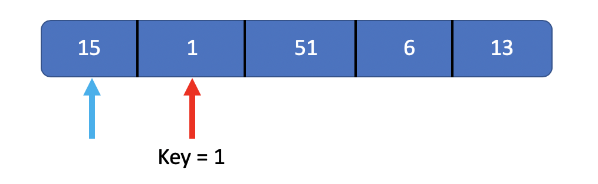

### Insertion-Sort

- [Pseudocode](#Pseudocode)
- [Process](#Process)

> Know about it by writing CODE.
> ***Because it's really easy!!!!***

#### Pseudocode

```
for j = 2 to A.length
	key = A[j]
	// Insert A[j] into the sorted sequence A[1...j-1]
	i = j - 1
	while i > 0 and A[i] > key
		A[i+1] = A[i]
		i = i - 1
	A[i + 1] = key
```

> Know more by reading the compelete code [here](../insert_sort.h)

#### Process

In order to help people who don't know about insertion-sort before. I made this. Let's check.


As we know, we start from the second element. We call it i, the value of i is between 0 and the size of this array or some structure else, the total number of elements. Then we get a key, the value of key is A[i].



Then we put the second pointer points to the element just before i, we call it j, j start from i - 1, end with 0.


If the element is pointed by j is bigger than the pointer i points, they exchange their values.


when j got the end, i plus one, new loop start.


***And so on....***


