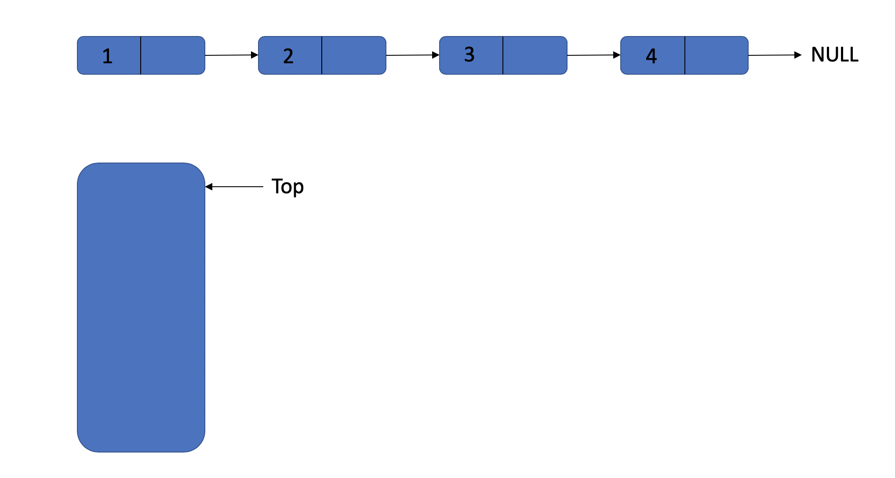
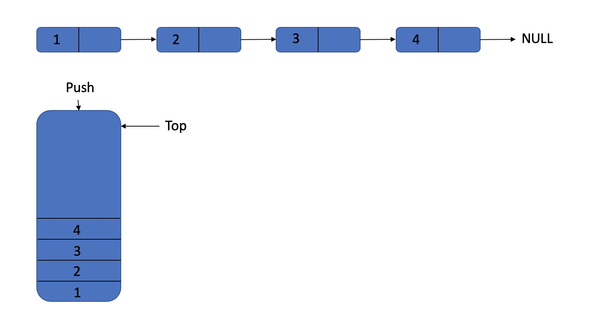
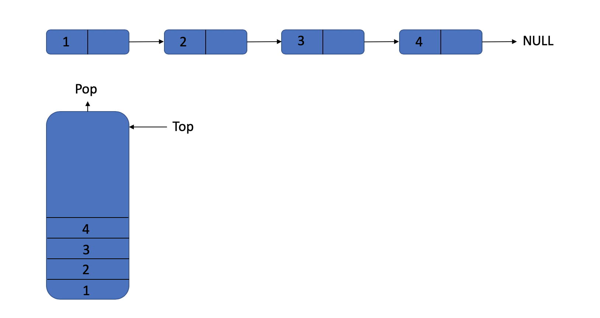
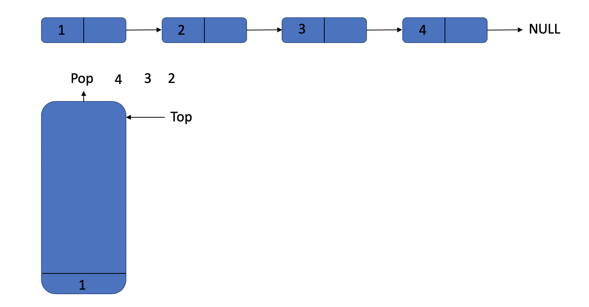

### Reverse Print List

- [Question](#Question)
- [Though](#Though)
- [Code](#Code)

#### Question

There is a single linkedlist that prints out the values of each node from end to head.

#### Though

I don't think it's a difficult problem, we just need use a stack, store the values and print them.
We do like this:

We got a list and a stack.

We push the values of list into the stack one by one.

And we already know about how stack works. If you don't know about it clearly, go [here](../../../data_structures/doc/lists/Stack.md#Stack) to read more.

At the last, we can get result by popping the elements from the stack.

#### Code

We use the [linkedlist](../../../data_structures/lists/linkedlist.h) and [stack](../../../data_structures/lists/stack.h) implemented before to implement it. Just read the code: [C Version](../code/c/reverse_print_list.h).
