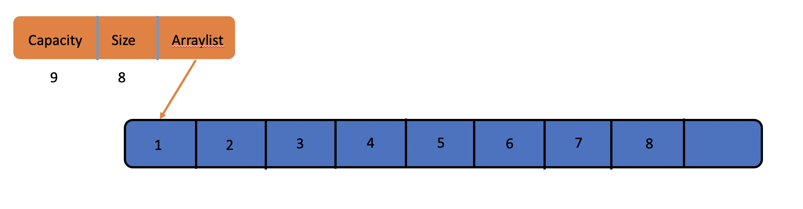
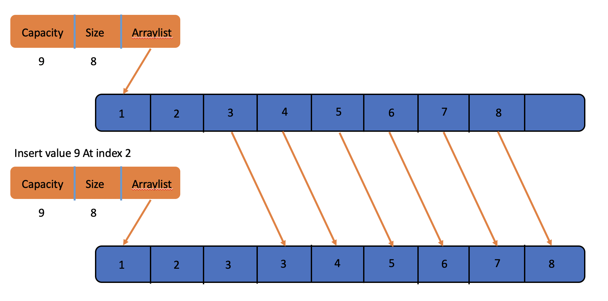
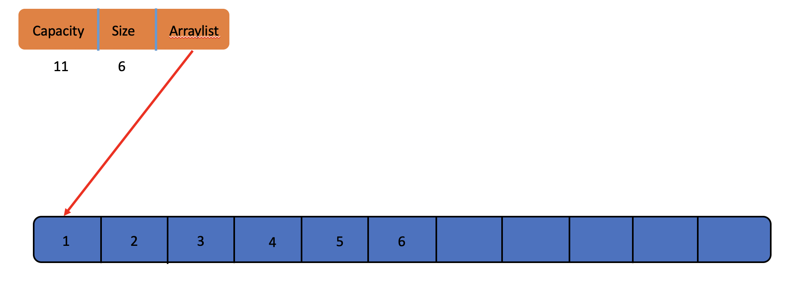
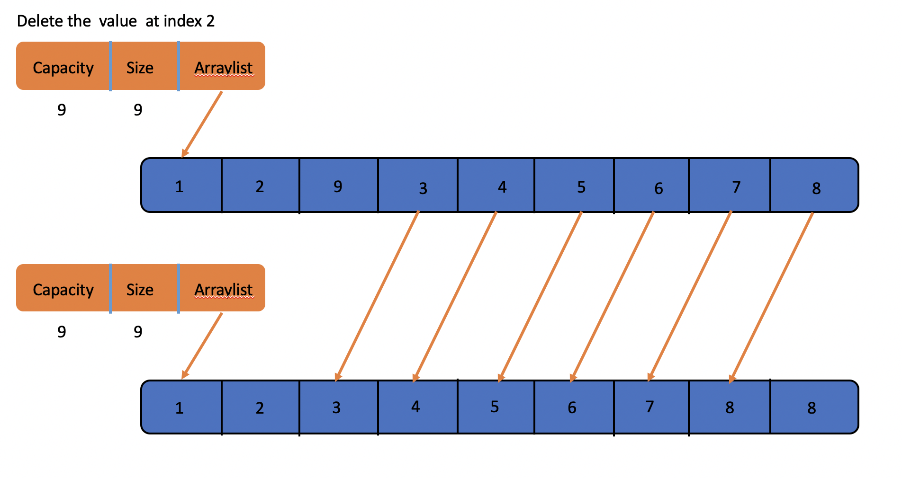
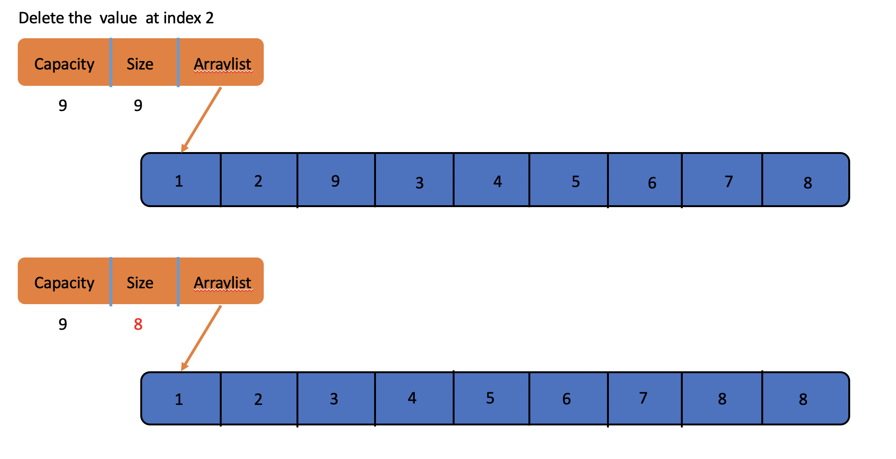

### ArrayList

- [Operations](#arraylist_operations)
- [Conclusion](#arraylist_conclusion)

Now let's talk about arraylist, we know it costs O(n) when you want access a value at the index you give by using a linkedlist, if you want make it faster to finish, you should use arraylist, it cost O(1) when you wanna access the index you want. Because the underlying is an array. So you can access any value at the index you give in one step, just arr[index]. It's pretty cool. Now let me show you what the arraylist look like.


And in my version, there's still head node here which save the total number of values in the arraylist, the pointer points to the arraylist and the capacity of the arraylist.Let's meet it first.



***Let's be clear:***

> **Size**: The total number of values saved in the arraylist
> **Capacity**: The capacity of the arraylist, means how many values can be saved in this arraylist now.
> **ArrayList**: The pointer points to the first address of the Array we save values.

Now let's review the basic operations of arraylist.

<h4 id="arraylist_operations">Operations</h4>

- [Insert](#arraylist_insert)
- [Delete](#arraylist_delete)

<h5 id="arraylist_insert">Insert</h5>

If we wanna insert a value into a arraylist at the tail, that'll be easy, just ```arr[L->Size] = Value```, but if we want to do more about insertion, we should do like this.

In this example, we want to insert value 9 at index 2 of the array.
First step, we should move all the values between index 2 and the end of array one step backward.



Second step, we just need to do like this. ```array[2] = 9```


It's finished. Pretty Easy. And it costs O(n). Don't forget to change the value of **Size**, it's supposed to plus one after doing this.


**But what happens when you insert an element when you have insufficient capacity?**

Here is the answer.

First step, we get a new capacity called NewCapacity, and ```NewCapacity = OldCapacity / 2 * 3 + OldCapacity``` in my version, you can modify it to your perferred value. Then we get a new array with capacity **NewCapacity**.


Second step we copy the elements of the old array to the new array in order.


Then we can do like inserting with enough room.




<h5 id="arraylist_delete">Delete</h5>

Then let's talk about deletion of arraylist. Same with insert at the tail, if you wanna delete the value at the tail, it's value be easy too, we just let the **Size** be smaller like this. ```L->Size -= 1```. But if you wanna do more?? We should be like this.

First Step. Move all the values between index 2 and the end of array one step forward, like this.



Then we just do like this. ```L->Size -= 1```. Finished. Easy too, but it's cost O(n) too;



**Delete Successed!!!**


<h5 id="arraylist_conclusion">Conclusion</h5>

And we're supposed to remember the cost of insertion and deletion by using linkedlist, it O(1), now we can see the differences between arraylist and linkedlist.

**Here, we just talk about the operations.**

| Implemetion | Delete At Tail | Insert At Tail | Delete At | Insert At | Access At | Access Specified Value |
| --- | --- | --- | --- | --- | --- | --- |
| LinkedList | O(1) | O(1) | O(1) | O(1) | O(n) | O(n) |
| ArrayList | O(1) | O(1) | O(n) | O(n) | O(1) | O(n) |

So, just choose the right way to save your data.