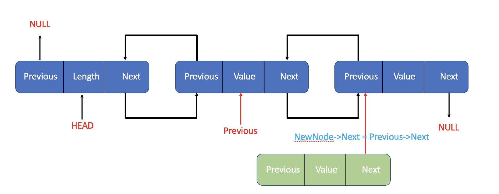
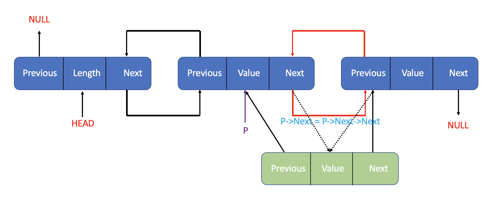

### Doubly LinkedList

- [Operations](#doublylinkedlist_operations)
- [Conclusion](#doublylinkedlist_conclusion)

Sometimes it's convenient to traverse lists backwards. We just add an extra field to the data structure, containing a pointer to the previous node.

Here is what Doubly LinkedList looks like.

In my version, there's still has a head node of the list, and it's value equals the total number of valid nodes.

Now we can see the basic operations of doubly linkedlist.

<h4 id="doublylinkedlist_operations">Operations</h4>

- [Insert](#doublylinkedlist_insert)
- [Delete](#doublylinkedlist_delete)

<h5 id="doublylinkedlist_insert">Insert</h5>

First Step, we get a new node called NewNode, and get it ready for insertion. Then we let the Next Pointer of NewNode equals the Next pointer of previous node.

Then we need to let the Previous pointer of the node that the Next pointer of previous node points to points to the NewNode.

Let the Next pointer of Previous node points to NewNode

Now we can let the Previous pointer of NewNode points to the Previous node.

**And then we finished the insertion. Insert at the end of the list is similar to this.**

<h5 id="doublylinkedlist_delete">Delete</h5>

First, we call the node we want to delete TargetNode.

As the picture shows, we should let the previous pointer of the next node of the TargetNode points to the previous node of the TargetNode.

Then we let the Next pointer of previous node points to the next node of the TargetNode.

**Finished!! Just don't forget to free the space of TargetNode.**

<h5 id="doublylinkedlist_conclusion">Conclusion</h5>

The cost of insertion or deletion still O(1).
It's just as same as [linkedlist](#LinkedList) -- The standard implementation.