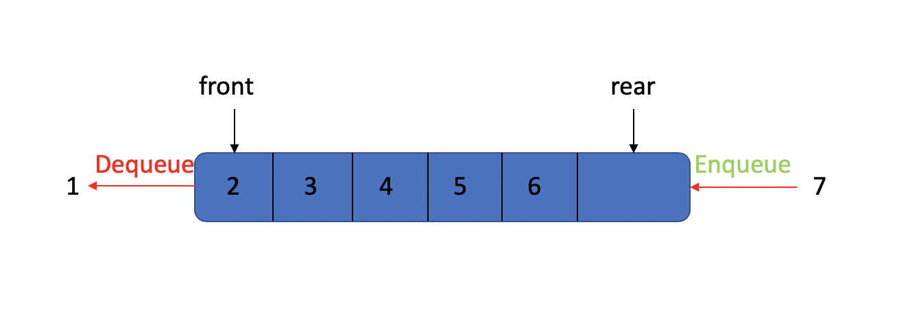

### Queue

- [Operations](#Operations)
- [Conclusion](#Conclusion)

Extracted from the book. **Like stacks, queue are lists. With a queue, however, insertion is done at one end, whereas deletion is performed at the other end.** Just like people are waiting in line.

Still from books. **The basic operations on a queue are _Enqueue_, which inserts and element at the end of the list(called the rear),and _Dequeue_, which deletes (and returns) the element at the start of the list(known as the front).**

It's look like this:

#### Operations

We already know about queue and it's basic operations above. That's pretty easy. So we are not going to talk more here.

We know stack run like **LIFO**(last in first out), queue is different, it's first in first out -- **FIFO**, just like people are waiting in line, remember?

And In my version, because the **Dequeue** operation is performed at the **front** of the queue , if we use arraylist, it cost O(n), we don't want it happen. So, we choose linkedlist to implement it, but the **Enqueue** operation is performed at the **rear** of the queue. If we just use a simple linkedlist, it's will cost O(n) to find the node at the end, so we modify the linkedlist, create a pointer points to the end of the linkedlist. we do it at [here](../../lists/linkedlist_with_tail_pointer.h).

#### Conclusion

Just see more [here](../../lists/queue.h).

