## AVL Trees

> **It's a long story.**

- [Definition](#Definition)
- [Operations](#Operations)

### Definition

AVL Tree -- **Adelson-Velskii and Landis**.

It's a binary tree with a **balance condition**.

> And we get **the balance condition must be easy to maintain, and it ensures that the depth of the tree is O(logN).**

As we know, and AVL tree is identical to a binary search tree, except that for **every node in the tree, the height of the left and right subtrees can differ by at most 1.** (The hight of an empty tree is defined to be -1.)

> Do you guys remember what is depth of a node??

> We review quickly here. **A depth of a node is length of the only way from root to this node.** And if you almost forget the basic concepts of trees. Go [there](./Trees.md#Basic-Concept-Of-Tree) for more.

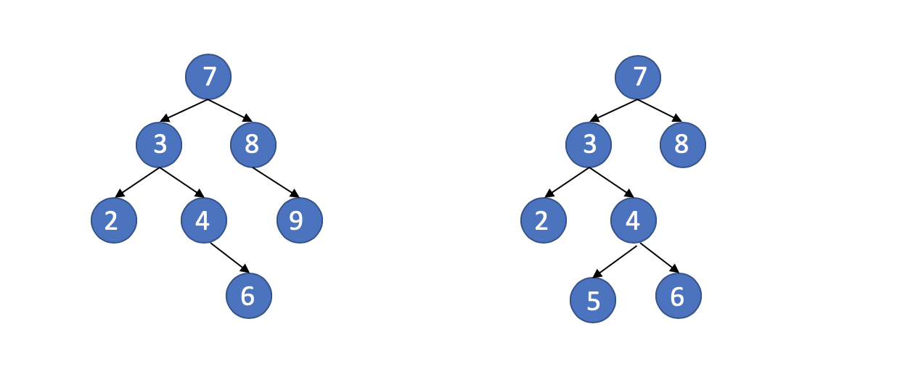

We get two binary search tree above.

But only the left one is a AVL tree. And we all know why now. If you don't know why, read one more above.

### Operations

- [Insertion](#Insertion)
    - [Rotation](#Rotation)
        - [Single Rotation](#Single-Rotation)
        - [Double Rotation](#Double-Rotation)
- [Deletion](#Deletion)

It's same with binary search tree when you wanna do some search in a AVL tree. Because we know, AVL trees all are binary search tree. We talk more about **[Insertion](#Insertion)** and **[Deletion](#Deletion)**.

#### Insertion

Because of the balance condition, when we do an insertion, we need to update all the balancing information for the nodes on the path back to the root, why we need to do this? **Because that insertion is potentially violate the AVL tree property.**
For example, if we insert 10 maybe bigger into the left tree above would destroy the balance condition at the node with value 8. Because if we do this, **the node with value 8 in the tree, the height of the left and right subtrees of it differ bigger than 1.**

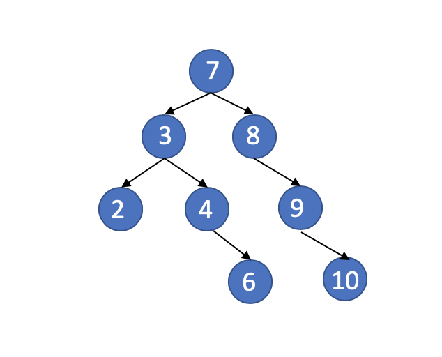

Not AVL Tree any more.

**We should keep the average depth of tree is O(logN).** It turns out that this can always be done with a simple modification to the tree, known as a ***[rotation](#Rotation)***.

##### Rotation

If we wanna do a rotation, we should find the node must be rebalanced, let's call it **Target**.

> ***Target means the node must be rebalanced now.***

We can know that the Target **must on the path from the insertion point to the root**, ***because only those nodes have altered their subtrees.***
As we follow the path up to the root and update the balancing information, we may find a node whose new balance violates the AVL condition.

When we find the ***Target***, we can do some operations on it.

We get four situations when the tree's balance condition is broken.

1. **An insertion into the left subtree of the left child of Target.**
2. **An insertion into the right subtree of the left child of Target.**
3. **An insertion into the left subtree of the right child of Target.**
4. **An insertion into the right subtree of the right child of Target.**

> Because any node has at most two children, and a height imbalance requires that the Target's two subtrees' height differ by two.

Let's see them before.

***Avl Tree***

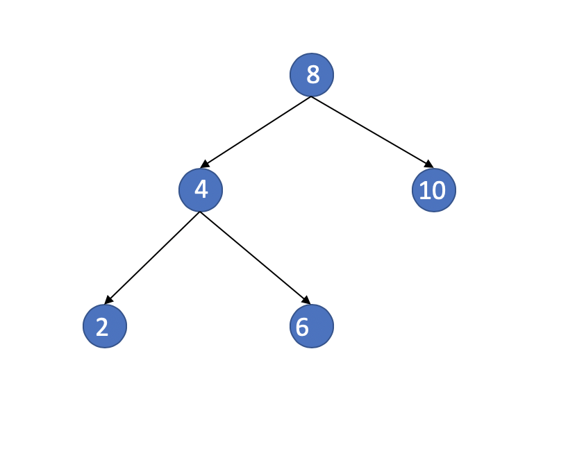

***First situation***

> The Target is 8.

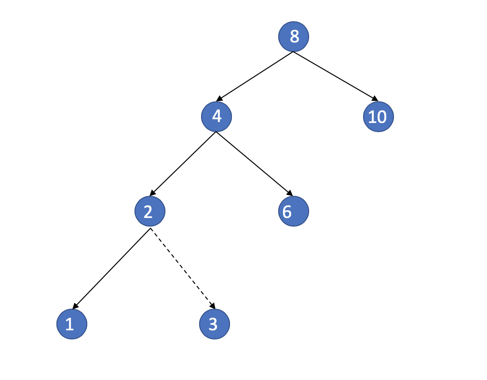

***Second situation***

> The Target is 8.

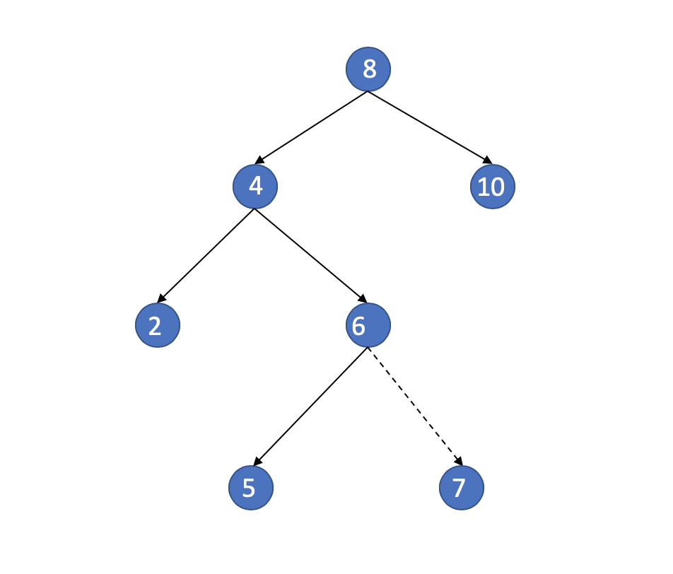

***Avl Tree***

> The target is 6

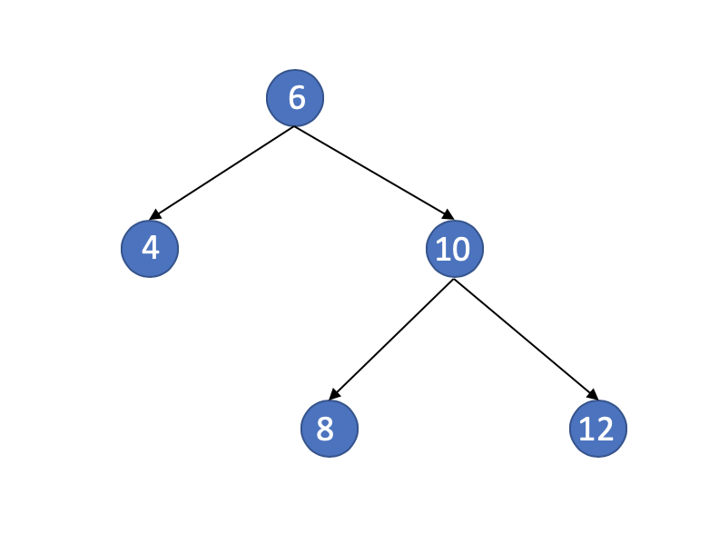

***Third Situation***

> The target is 6.

***Fourth Situation***

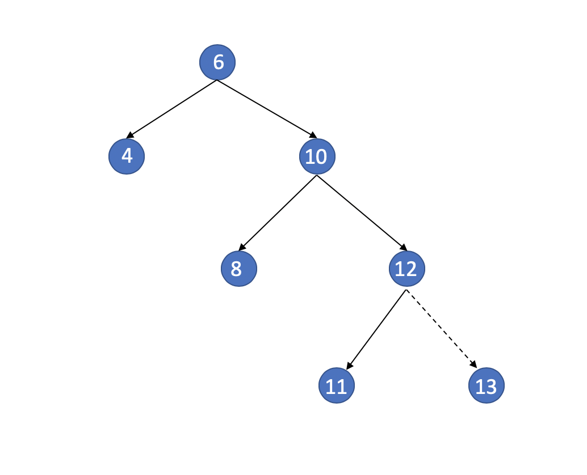

> Case 1 and 4 are mirror image symmetries with respect to Target, as are case 2 and 3.
But it's different from a programming perspective.

###### Single Rotation

Single Rotation is the solution of **Situation One** and **Situation Four**.

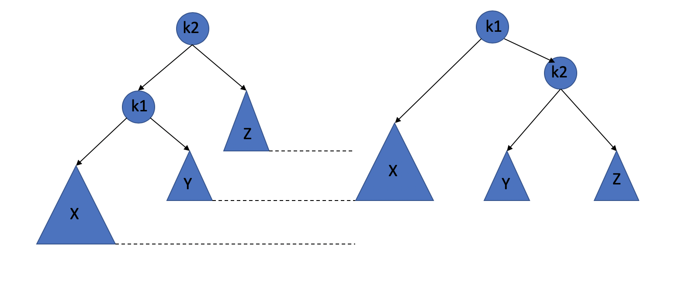

As we can see above, when we insert a node into the left child of the left subtree of the node with value k2, it will break the balance of the tree.
Now we need to do something now.
When we finish the insertion, subtree X grown to an extra level, causing it to be exactly two levels deeper than subtree Z.

> There's something we need to notice that **it's a AVL tree before the insertion**. so Subtree Y cannot at the same level as the new X.

In order to rebalance the tree, we would like to **move X up a level** and **Z down a level**.

I quote this sentence from the book, **visualize the tree as being flexible, grab the child node k1, close your eyes, and shake it, letting gravity take hold.**

And it becomes the right tree above.

**Why it works?**

> The binary search tree property tells us that in the original tree k2 > k1, so it can be the right child of k1 in the new tree, and subtree Y, which holds items that are between k1 and k2 in the original tree, can be placed as k2's left child in the new tree and satisfy all the ordering requirements.

**Let us find an example:**

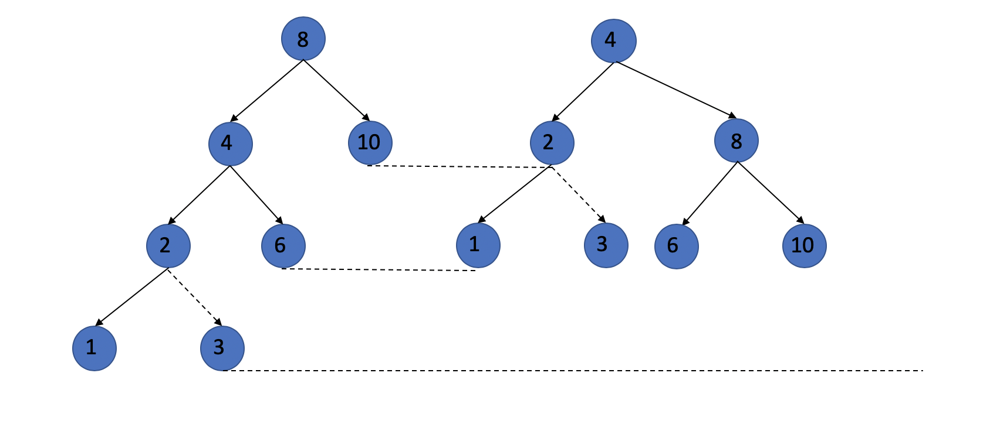

**Through the steps we have described above, we will rebalance the tree when we insert node 1 or node 3 and cause the tree become unbalanced.**

> Now we know how to solve the first situation, In the fourth case, we have already learned that situation one and situation four are mirroring problems. So the steps to solve the problem are just symmetrical.

###### Double Rotation

**This is for the Second situation and the Third situation.**

> ***Q: We already know how to do a single rotation, but if we do it when we face the second situation and third situation?***

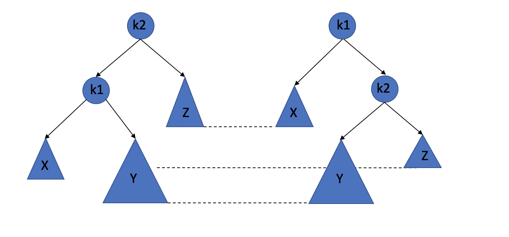

**It doesn't work!!!**

> **Q: What should we do now?**

+ First, we make this become the right one.

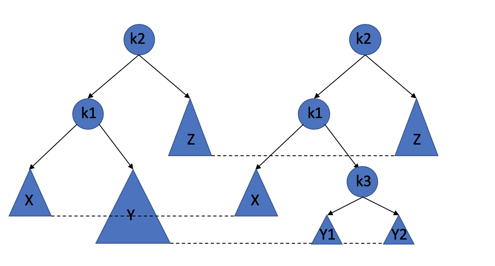

+ Then we do some rotations on this tree, actually it's double rotation.

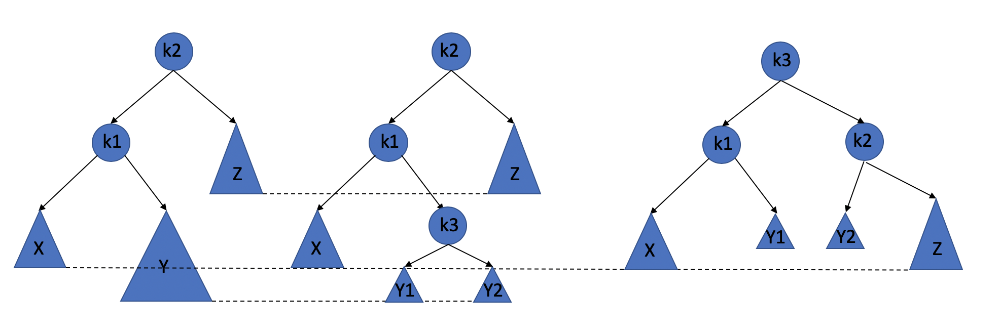

After the above study, we know that we cannot let the k1 be the root node, and the one rotation is not work. so, we should place the k3 as the new root, and let the k1 to be k3's left child, the let the Y1 to be the right subtree of k1, and let the k2 to be the left child of k3, the Y2 to be the left subtree of k2. And then, we finished the rebalance. Maybe my words are complicated(because my English is really bad), but the picture above is clear. Try think about it yourself, if you cannot read my words.

> And situation two and situation three are mirroring problems. So, the same idea.
> And we call the double rotation of second situation **Left-Right**, and for situation three, called **Right-Left**.

#### Deletion

We talk about deletion in the [code.](../../trees/avl_trees.h)

