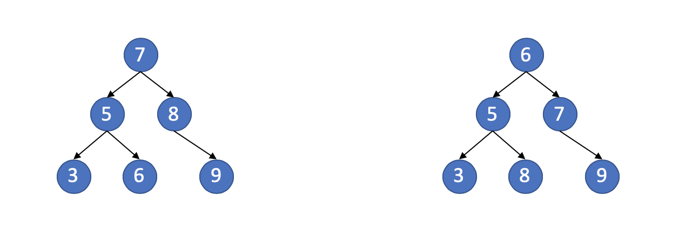
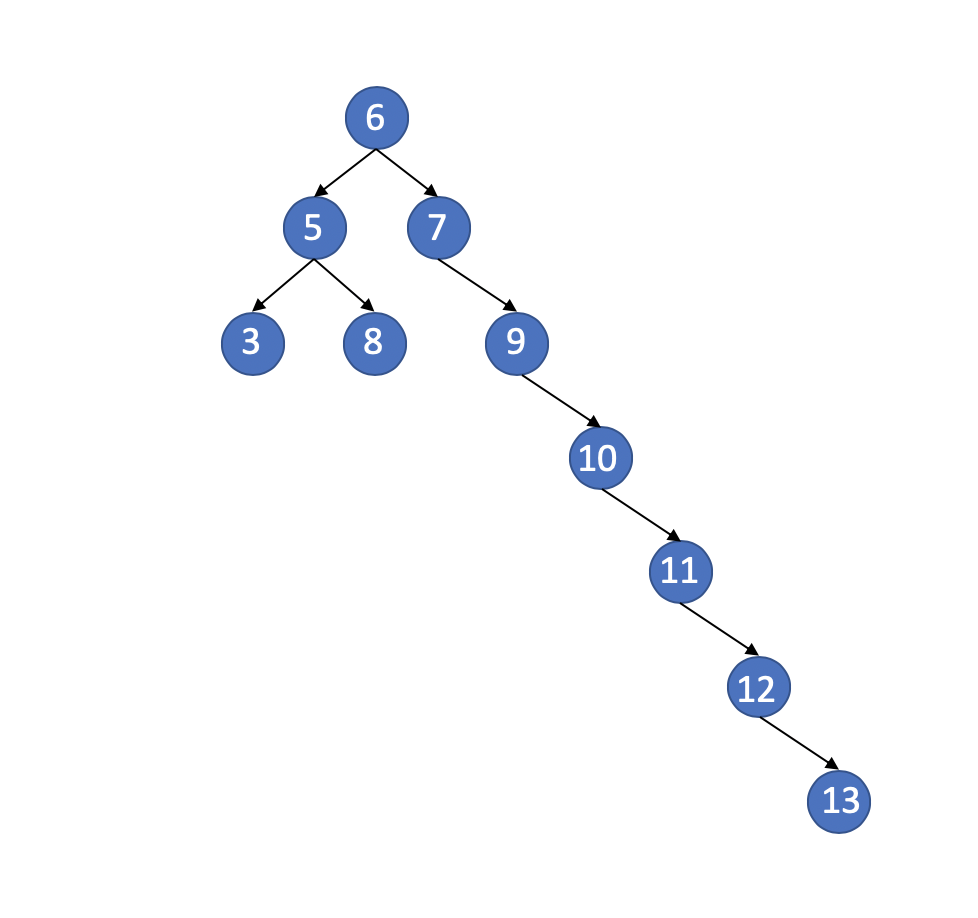

### Binary Search Tree

- [Definition](#definition)
- [Operations](#operations)

#### Definition

**Searching is the most useful application of binary trees.**

There're two binary tree. But only the left one is binary search tree.

***So, what makes a binary tree into a binary search tree?***

> The property that makes a binary tree into a binary search tree is that for **every** node N, the values of all the nodes in its left subtree are **smaller** than the value of N.
> Absolutely, in the right tree of picture above, there's a number 8 is bigger than root node in its left subtree.

#### Operations

- [Make Empty](#make-empty)
- [Find](#find)
- [Insert](#Insert)

Now we can define some operations on Binary Search Tree.

##### Make Empty

This operation is mainly for initialization. Note that because of the recursive definition of trees, it's common to write these routines recursively. And because the average depth of a binary search tree is O(logN), so we also don't need to worry about running out of stack space. And an initialization operation is also a simple routine. We can see more the [code](../../trees/binary_search_trees.h).

##### Find

Or we can call it search. Because of the definition of binary search trees, we can do some find operations easily, for example, find the max number of this tree, or find the min number of this tree, or maybe find some numbers we want. It's all can be easy to implement.

##### Insert

Throw the problem directly. If we always insert a node with a value bigger than value of all the nodes,  the tree can be like this.

or if with a value smaller that value of all the nodes, it's just exactly the opposite.

But if we do like this, it broke the hope of binary tree -- the average of depth of a binary search tree is O(logN). We absolutely don't want this, this denies the meaning of the tree. So, what we should do when we facing the situation?

We'll talk more about this when we learn about [AVL Tree](./AvlTree.md#Avl-Trees).

