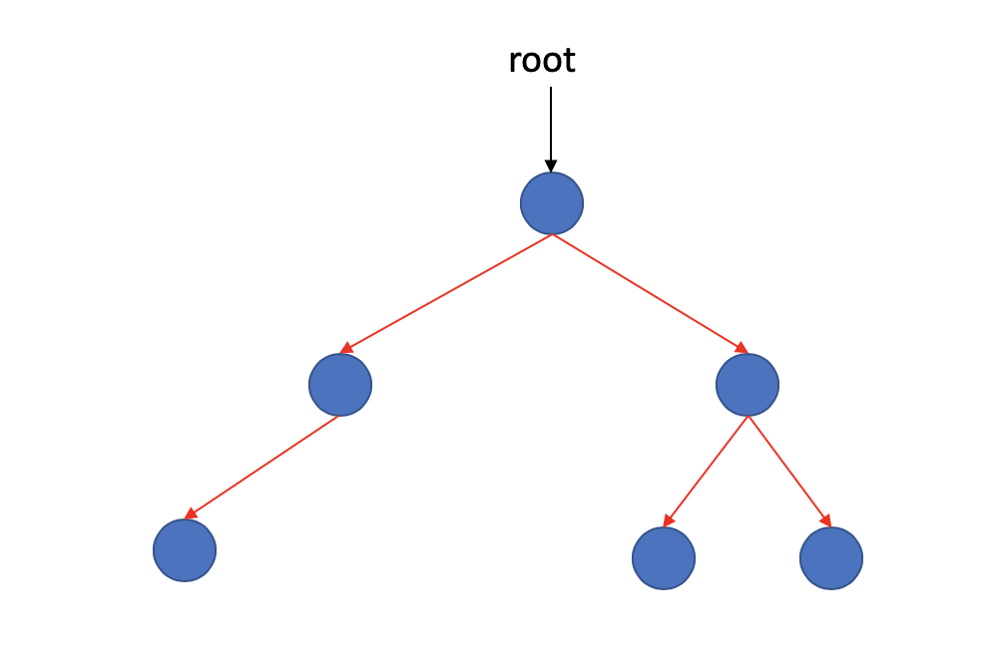
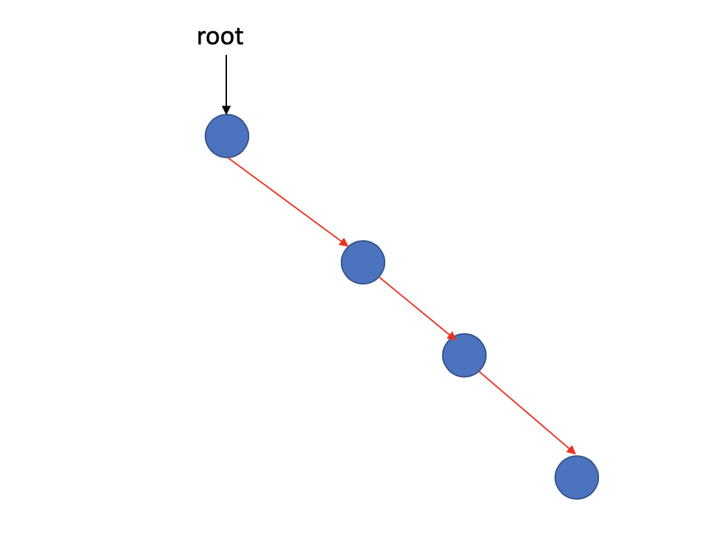

### Binary Trees

- [Definitions](#Definitions)
- [Operations](#Operations)
    - [Traverse](#Traverse)
    - [Insertion](#Insertion)
    - [Deletion](#Deletion)
- [Code](#Code)

#### Definitions

**A binary tree is a tree in which NO node can have more than two children.**

It's look like this.

***No node have more than two children !!!*** 

> Other than this, there is no more difference with the tree.

A property of a binary tree that is sometimes important is that the depth of an average binary tree is considerably smaller than N.

It's the worst situation above. It becomes a linked list already. That's not what we want.

And an analysis shows that the average depth is O(), and that for a special type of binary tree, namely binary search tree. The average value of the depth is O(logN).

#### Operations

We just talk about traverse of a binary tree here. And we'll do more, for example, insertion and deletion when we implement binary search tree.

##### Traverse

We have three ways of traversing.

**inorder traversal**: ***[left, node, right]***. Means we traverse the left child of a node first, then itself, finally  its right child. We do it for all nodes in the same tree until the traverse finish. ***Similar below***.

**postorder traversal**: ***[left, right, node]***

**preorder traversal**: ***[node, left, right]***

In fact, we still have a way of traversing: **Hierarchical traversal**. It's from top to bottom, starting from the layer of root node, from left to right, traversing all nodes layer by layer.

We'll implement those above.

##### Insertion

Different binary trees have different ways of insertion. In first version, the simplest binary tree, We insert it as a complete binary tree.

##### Deletion

Same as insertion.

#### Code

The binary tree is simple and efficient. But there are many different implementations for different functions. Some implementations are relatively difficult to understand, but rest assured, I will do my best to explain clearly through the codes and documentations.

See more about the [simplest binary tree](../../trees/binary_trees.h).

