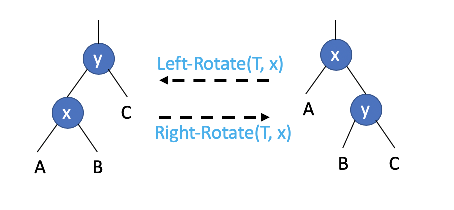

## Red-Black Trees

- [What's it for?](#Whats-it-for)
- [What's it?](#Whats-it)

### What's it for?

We got a binary search tree, and we know that a binary search tree of height ***h*** can support any of the basic dynamic-set operations - such as **Search**, **Predecessor** -- in ***O(h)*** time. ***The set operations are fast if the height of the search tree is small.*** So! **If its height is large, the set operations may run no faster than a linked list.**

### What's it?

- [Definition](#Definition)
- [Basic Concept](#Basic-Concept)

#### Definition

Red-Black trees are one of many search-tree schemes that are "balanced" in order to guarantee that the basic dynamic-set operations take **O(lgN)** time in the worst case.

So, it's a better **binary search tree**.

#### Basic Concept

> ***Q: What's kind of binary search tree is a Red-Black Tree?***

1. **Every node is either red or black**
2. **The root is black**
3. **Every leaf is black**
4. **If a node is red, then both its children are black**
5. **For each node, all simple paths from the node to descendant leaves contains the same number of black nodes.**

**Black-Height**: The number of black nodes on any simple path from, but not including, a node x down to a leaf.

#### Operations

##### Rotations

- [What's it for?](#whats_it_for_rotations)
- [What's it?](#whats_it_rotations)
- [Operations](#operations_rotations)

<h6 id="whats_it_for_rotations">What's it for?</h6>

**The operations Insert and Delete modify the tree, the result may violate the red-black properties. We need to do something to restore these properties.**

<h6 id="whats_it_rotations">What's it?</h6>

**It's a local operation in a search tree that preserves the binary-search-tree property.**

<h6 id="operations_rotations">Operations</h6>

We show two kinds of rotations here: **Left-Rotate** and **Right-Rotate**.



> The above two node states are converted by **Left-Rotation** and **Right-Rotation**.

###### Precedes

```c
y = x.right
x.right == y.left
if y.left != NULL
    y.left.p = x
y.p = x.p
if x.p == NULL
    T.root = y
elseif x == x.p.left
    x.p.left =y
else x.p.right = y
y.left = x
x.p = y
```

