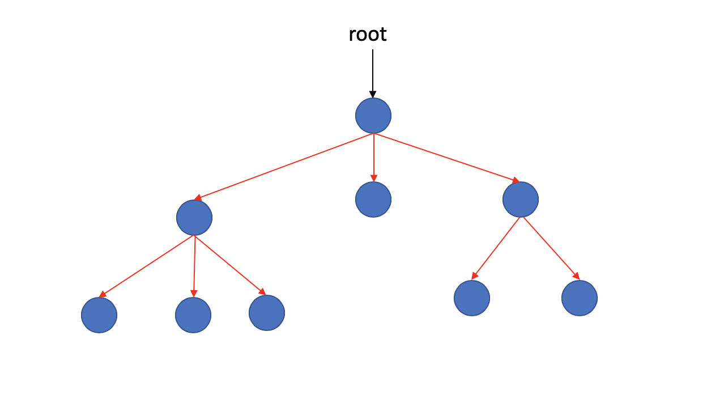
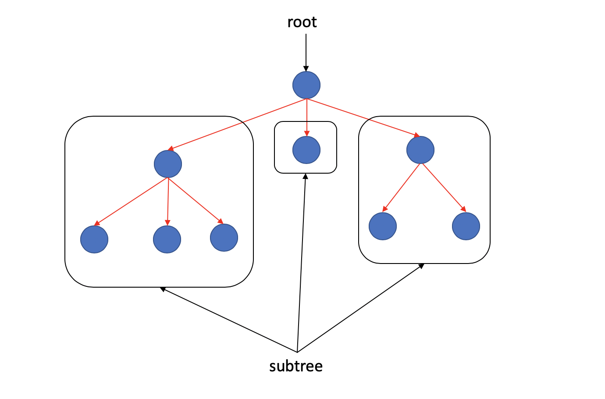
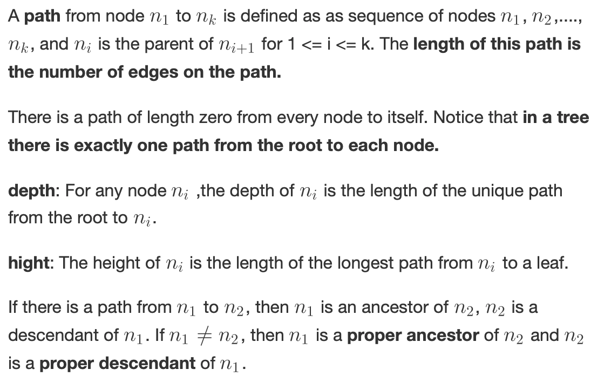
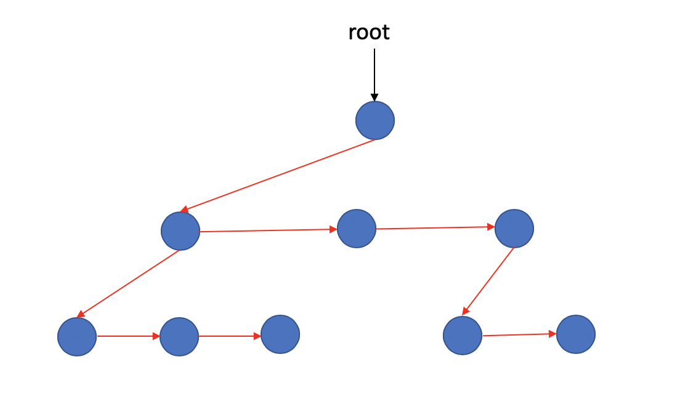

### Trees

- [Basic concept of tree](#Basic-Concept-Of-Tree)
- [How to Implement a Tree](How-to-implement-a-Tree)
- [Tree Traversals with an Application](Tree-Traversals-with-an-Application)

#### Basic Concept Of Tree

First, let's talk about tree.

**Why we need Tree???**

We you get large amounts of input, the linear access time of linked lists is prohibitive. Using a sequential table structure can make access speed slow when there is a lot of input. Then, tree can help you solve those problems.

This is a tree look like.



A tree can be defined in several ways. One natural way to define a tree is recursively. A tree is a collection of nodes. The collection can be empty; otherwise, a tree consists of a distinguished node r, called the ***root***, and zero or more nonempty subtrees, like those framed by black frames, those are trees two, belongs to the bigger one. And the root of each subtree is said to be a ***child*** of r(oot), r is the parent of each subtree root, and so on.

From the recursive definition, we find that a tree is a collection of N nodes, one of them is the root, and there're N - 1 edges, each edge connect some node to its parent, and every node except the root has one parent.



**Leaves**: Nodes without no children are known as leaves.



#### How to implement a Tree

We know a tree consist of nodes. But what kind of node definition can form a tree??

Because all nodes are same, so, if we need a unified node definition, means that the definition of the node must be same.

Since the number of children per node can vary so greatly and is not known in advance, it might be infeasible to make the children direct links in the data structure, because there would be too much wasted space.

We found this way can help us.



If we let a node got two pointer, one of them point to first child of it, another one point to its next sibling. Then it can give us a unified definition of nodes.

```c
typedef struct TreeNode *PtrToNode;

struct TreeNode
{
    ElementType Element;
    PtrToNode FirstChild;
    PtrToNode NextSibling;
}
```

#### Tree Traversals with an Application

> All of this comes from book -- **《Data Structures and Algorithms analysis in C.》**

Trees are powerful. One of the popular uses is the directory structure in man common operating systems, such as UNIX, VAX/VMS and so on.

We got a code from the book.

```c
static void
ListDir(DirectoryOrFile D, int Depth)
{
    if(D is a legitimate entry)
    {
        PrintName(D, Depth);
        if (D is a directory)
            for each child, C, of D
                ListDir(C, Depth + 1);
    }
}

void
ListDirectory(DirectoryOrFile D)
{
    ListDir(D, 0);
}
```

And we'll do more in our [code](../../trees/trees.h).


