## Contents
- [LinkedList](#LinkedList)
- [Doubly LinkedList](#Doubly-LinkedList)
- [ArrayList](#ArrayList)

### LinkedList

- [Operations](#linkedlist_operations)
- [Conclusion](#linkedlist_conclusion)

Here is the linked list. It looks like this.


> In order to avoid the linear cost of insertion and deletion, we need to ensure that the list is not stored contiguously. By using this kind of list, we can make the cost of insertion and deletion be O(1).
The linked list consists of a series of structures, which are not necessarily adjacent in memory.
Each node contains the element and a pointer points to the next node, we call it Next pointer, And the last node's Next pointer points to NULL. And ANSI C specifies that NULL is zero.

In my version, I put a head node to save the length of the linked list.


Now we can see the operations of LinkedList.

<h4 id="linkedlist_operations">Operations</h4>

- [Insert](#linkedlist_insert)
- [Delete](#linkedlist_delete)

<h5 id="linkedlist_insert">Insert</h5>


It's the first step of the insert operation.

As we can see, we got Node A, B, C, and the C is the newest node we wanna insert into this list. First we make the Next pointer of C equals Next pointer of A, then the C node's Next Pointer points to node B.

second step, we let the A's Next pointer points to our new node C.


Finally, we finished it.

***Insert Successed!!***


<h5 id="linkedlist_delete">Delete</h5>

We'll show two steps of delete operation.

First step, we let the node A's Next pointer equals the Next pointer of node C.


Second step, because we just get one Next pointer for each node, so, it just make no pointer points to node C.


**So delete Successed!!**

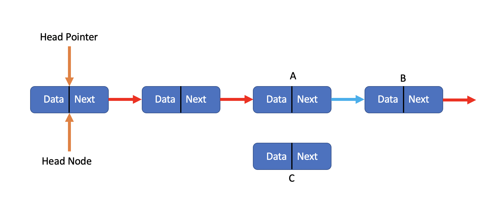

<h5 id="linkedlist_conclusion">Conclusion</h5>

We know that if you just calculate the cost of insertion or deletion, you'll find T(n) = O(1).
But you know if we wanna insert or delete a value with speicify index, it'll cost O(n) in whole operation. But the cost of insertion or deletion still is O(1). Here, we just talk aboult the cost of insertion or deleteion.

### Doubly LinkedList

- [Operations](#doublylinkedlist_operations)
- [Conclusion](#doublylinkedlist_conclusion)

Sometimes it's convenient to traverse lists backwards. We just add an extra field to the data structure, containing a pointer to the previous node.

Here is what Doubly LinkedList looks like.

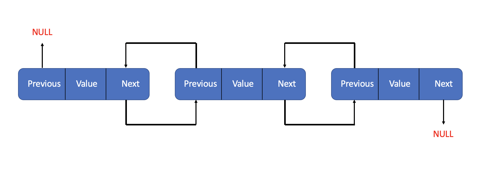

In my version, there's still has a head node of the list, and it's value equals the total number of valid nodes.

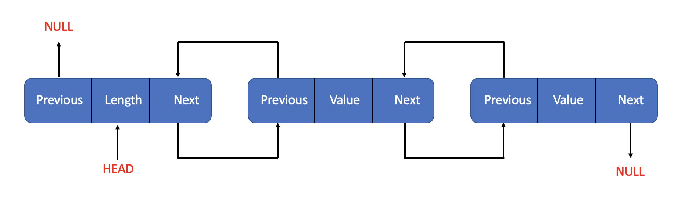

Now we can see the basic operations of doubly linkedlist.

<h4 id="doublylinkedlist_operations">Operations</h4>

- [Insert](#doublylinkedlist_insert)
- [Delete](#doublylinkedlist_delete)

<h5 id="doublylinkedlist_insert">Insert</h5>


First Step, we get a new node called NewNode, and get it ready for insertion. Then we let the Next Pointer of NewNode equals the Next pointer of previous node.

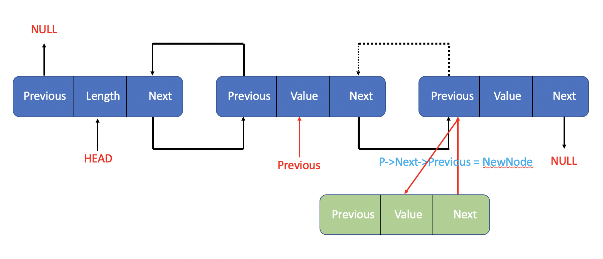

Then we need to let the Previous pointer of the node that the Next pointer of previous node points to points to the NewNode.

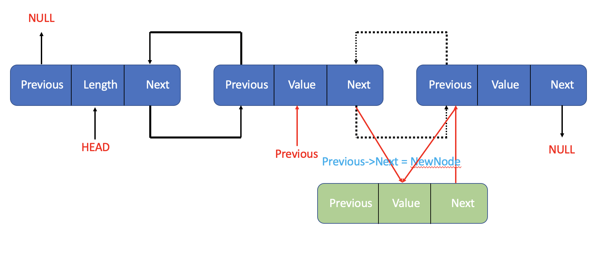

Let the Next pointer of Previous node points to NewNode

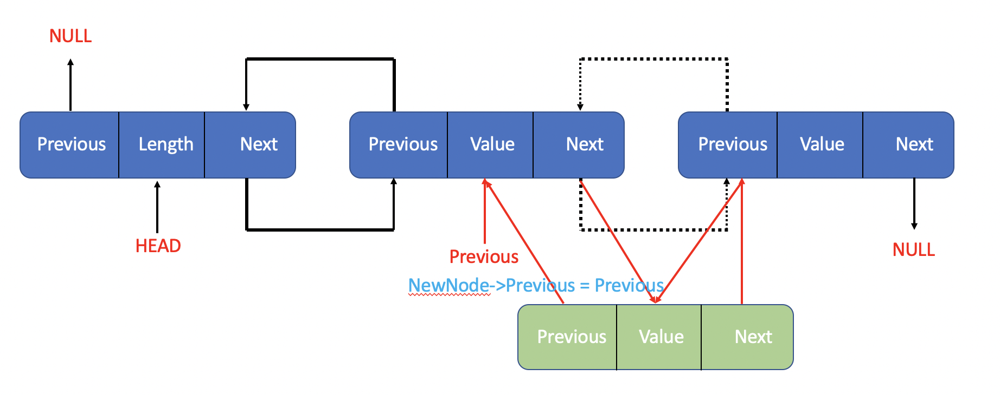

Now we can let the Previous pointer of NewNode points to the Previous node.

**And then we finished the insertion. Insert at the end of the list is similar to this.**

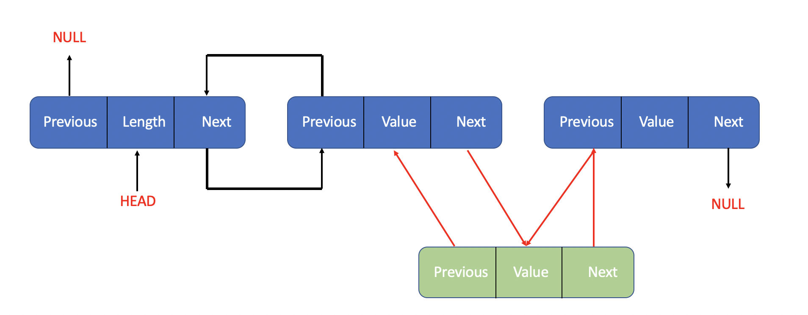

<h5 id="doublylinkedlist_delete">Delete</h5>

First, we call the node we want to delete TargetNode.

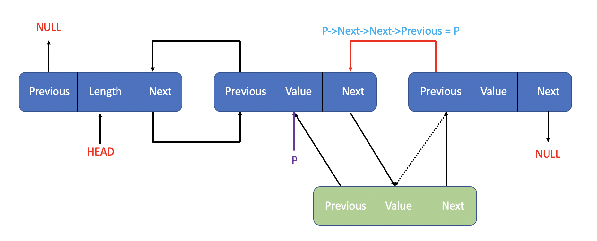

As the picture shows, we should let the previous pointer of the next node of the TargetNode points to the previous node of the TargetNode.


Then we let the Next pointer of previous node points to the next node of the TargetNode.

**Finished!! Just don't forget to free the space of TargetNode.**

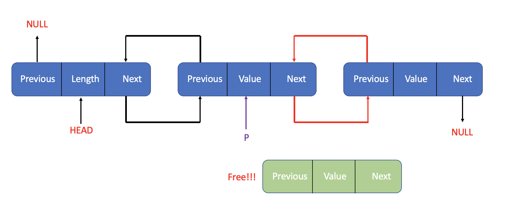

<h5 id="doublylinkedlist_conclusion">Conclusion</h5>

The cost of insertion or deletion still O(1).
It's just as same as [linkedlist](#LinkedList) -- The standard implementation.

### ArrayList

Now let's talk about arraylist, we know it costs O(n) when you want access a value at the index you give by using a linkedlist, if you want make it faster to finish, you should use arraylist, it cost O(1) when you wanna access the index you want. Because the underlying is an array. So you can access any value at the index you give in one step, just arr[index]. It's pretty cool. Now let me show you what the arraylist look like.

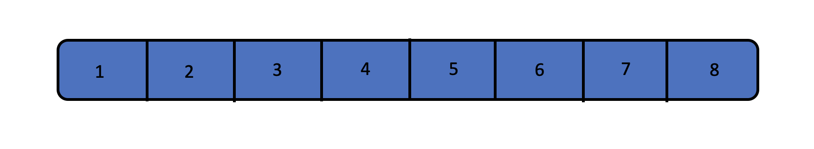

And in my version, there's still head node here which save the total number of values in the arraylist, the pointer points to the arraylist and the capacity of the arraylist.Let's meet it first.


***Let's be clear:***

> **Size**: The total number of values saved in the arraylist
> **Capacity**: The capacity of the arraylist, means how many values can be saved in this arraylist now.
> **ArrayList**: The pointer points to the first address of the Array we save values.

Now let's review the basic operations of arraylist.

- [Operations](#arraylist_operations)
- [Conclusion](#arraylist_conclusion)

<h4 id="arraylist_operations">Operations</h4>

- [Insert](#arraylist_insert)
- [Delete](#arraylist_delete)

<h5 id="arraylist_insert">Insert</h5>

If we wanna insert a value into a arraylist at the tail, that'll be easy, just ```arr[L->Size] = Value```, but if we want to do more about insertion, we should do like this.

In this example, we want to insert value 9 at index 2 of the array.
First step, we should move all the values between index 2 and the end of array one step backward.


Second step, we just need to do like this. ```array[2] = 9```
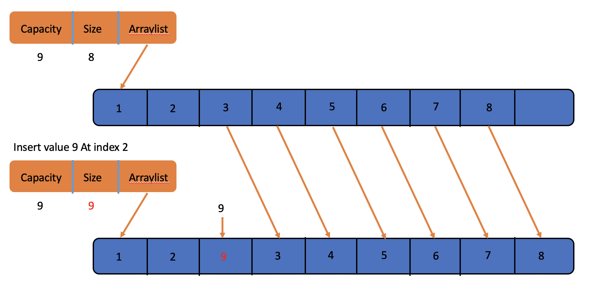

It's finished. Pretty Easy. And it costs O(n). Don't forget to change the value of **Size**, it's supposed to plus one after doing this.

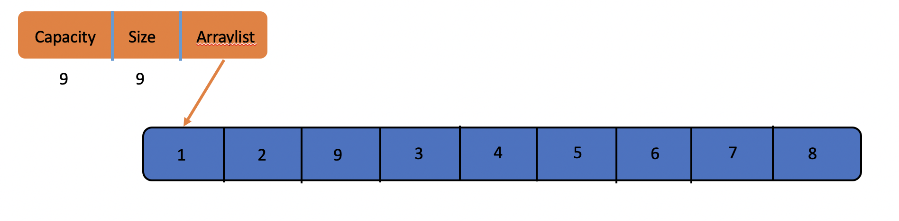

**But what happens when you insert an element when you have insufficient capacity?**

Here is the answer.

First step, we get a new capacity called NewCapacity, and ```NewCapacity = OldCapacity / 2 * 3 + OldCapacity``` in my version, you can modify it to your perferred value. Then we get a new array with capacity **NewCapacity**.

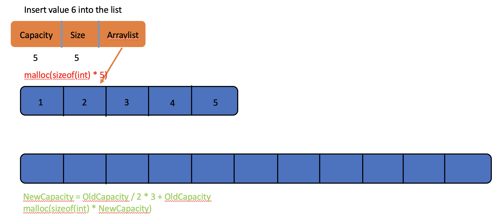

Second step we copy the elements of the old array to the new array in order.


Then we can do like inserting with enough room.

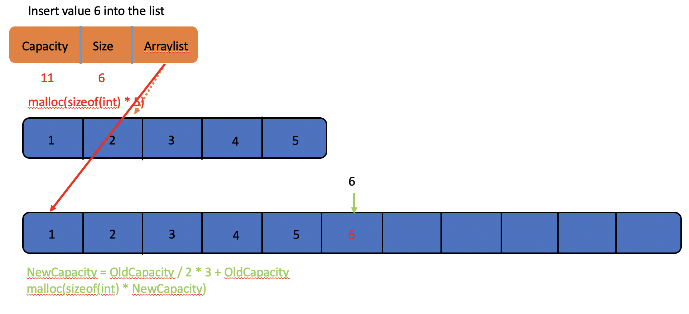


<h5 id="arraylist_delete">Delete</h5>

Then let's talk about deletion of arraylist. Same with insert at the tail, if you wanna delete the value at the tail, it's value be easy too, we just let the **Size** be smaller like this. ```L->Size -= 1```. But if you wanna do more?? We should be like this.

First Step. Move all the values between index 2 and the end of array one step forward, like this.


Then we just do like this. ```L->Size -= 1```. Finished. Easy too, but it's cost O(n) too;


**Delete Successed!!!**


<h5 id="arraylist_conclusion">Conclusion</h5>

And we're supposed to remember the cost of insertion and deletion by using linkedlist, it O(1), now we can see the differences between arraylist and linkedlist.

**Here, we just talk about the operations.**

| Implemetion | Delete At Tail | Insert At Tail | Delete At | Insert At | Access At | Access Specified Value |
| --- | --- | --- | --- | --- | --- | --- |
| LinkedList | O(1) | O(1) | O(1) | O(1) | O(n) | O(n) |
| ArrayList | O(1) | O(1) | O(n) | O(n) | O(1) | O(1) |

