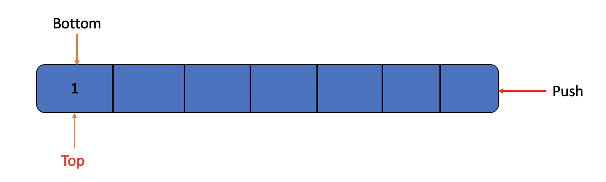
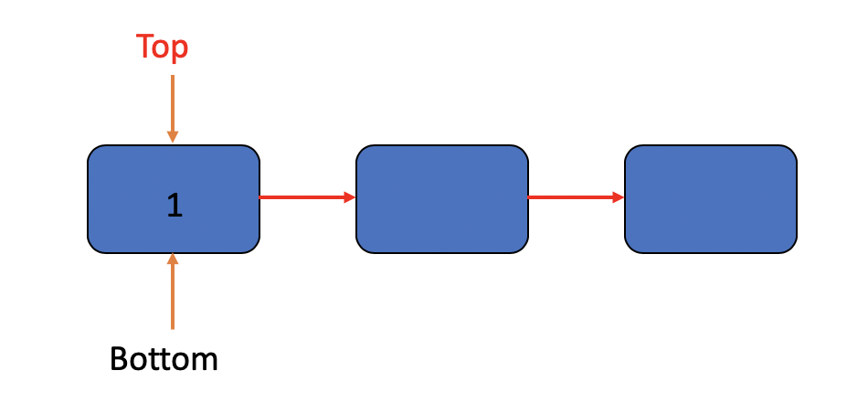
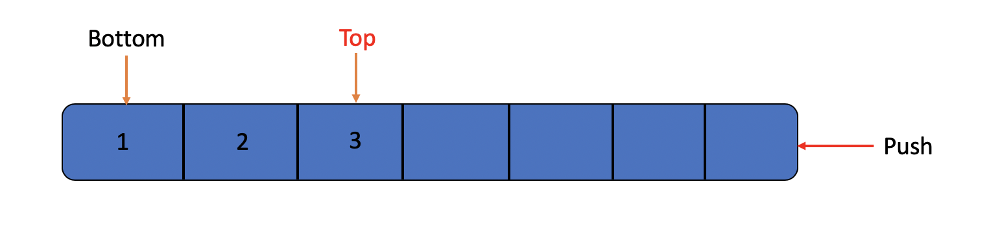
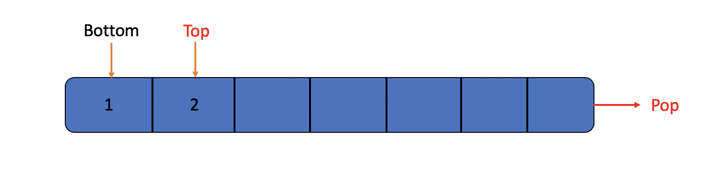
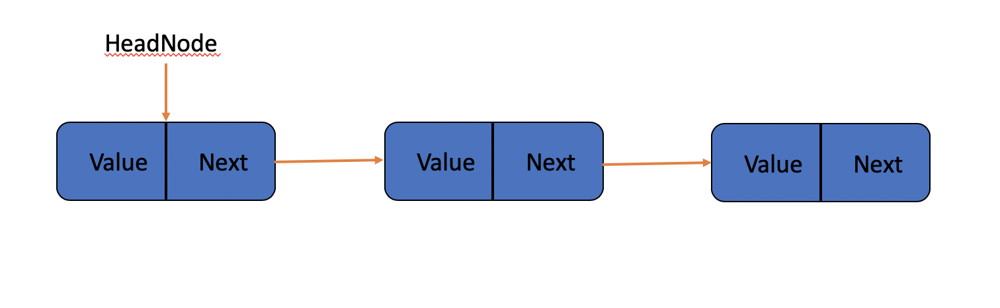

### Stack

- [Operations](#Operations)
- [Conclusion](#Conclusion)

A stack is a list with the restriction that insertinos and deletions can be performed in only one position. We call this behavior last in first out(**lifo**), and the position, we call it **top**, top of a stack.

Those Pictures shows a stack can be.

It can be ...

or It can be ...

As we can see, The most recently inserted element can be examined prior to performing a Pop by use of Top routine.

#### Operation

- [Push](#Push)
- [Pop](#Pop)
- [Implemention](#Implemention)

##### Push

It easy to understand how to push a value into a stack.

##### Pop

It also easy to understand how to pop a value into a stack.

##### Implemention

Actually, stack still is a list, whatever a linkelist or arraylist, all of them can be the data structure of a stack.
In my version, I use the linkedlist as the data structure of it.

For better push of element, I make the head node points to the **Top**, and the last node of this linkedlist called **Bottom**.

