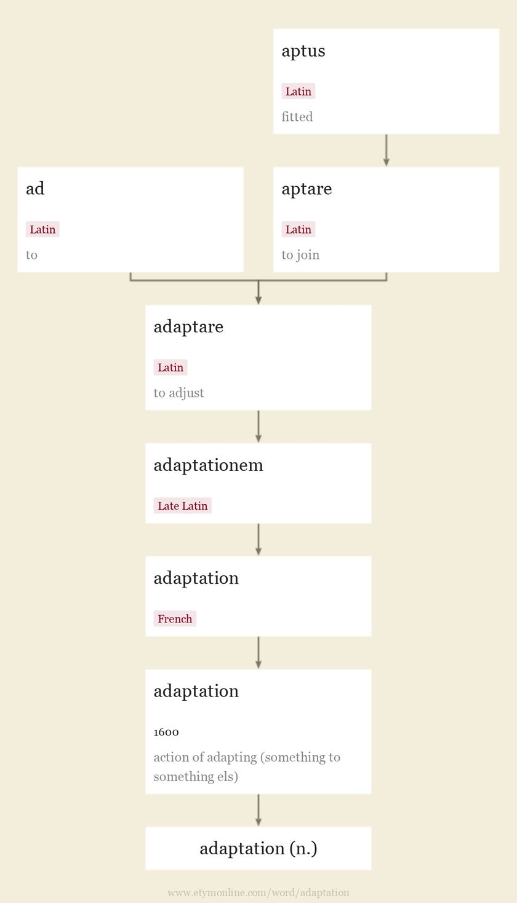

## First Day Words

- [Part A](#Part-A)
	- [stock](#stock)
	- [adaptation](#adaptation)
	- [advanced](#advanced)
	- [bound](#bound)
	- [cast](#cast)
	- [sharp](#sharp)
	- [sheet](#sheet)
	- [shift](#shift)
	- [stick](#stick)
	- [access](#access)
- [Part B](#Part-B)
	- [account](#account)
	- [accumulate](#accumulate)
	- [accustom](#accustom)
	- [acid](#acid)
	- [acoustic](#acoustic)
	- [acquire](#acquire)
	- [adaptive](#adaptive)
	- [address](#address)
	- [adjacent](#adjacent)
	- [adjust](#adjust)
- [Part C](#Part-C)
	- [administration](#administration)
	- [adopt](#adopt)
	- [adverse](#adverse)
	- [aesthetic](#aesthetic)
	- [afford](#afford)
	- [agent](#agent)
	- [aggregate](#aggregate)
	- [agitate](#agitate)
	- [agricultural](#agricultural)
	- [altitude](#altitue)
- [Part D](#Pard-D)
	- [analogy](#analogy)
	- [anomaly](#anomaly)
	- [Antarctica](#Antarctica)
	- [appeal](#appeal)
	- [application](#application)
	- [appreciate](#appreciate)
	- [apprentice](#apprentice)
	- [approach](#approach)
	- [approximate](#approximate)
	- [aquatic](#aquatic)
- [Pard E](#Pard-E)
	- [Arctic](#Arctic)
	- [aristocracy](#aristocracy)
	- [arouse](#arouse)
	- [artifact](#artiface)
	- [assemble](#assemble)
	- [assess](#assess)
	- [astronomy](#astronomy)
	- [atmospheric](#atmospheric)
	- [attachment](#attachment)
	- [authoritative](#authoritative)
- [Pard F](#Pard-F)
	- [barren](#barren)
	- [biological](#biological)
	- [blur](#blur)
	- [boast](#boast)
	- [bond](#bond)
	- [burst](#burst)
	- [bust](#bust)
	- [campaign](#campaign)
	- [carbon](#carbon)
	- [casual](#casual)
- [Part G](#Part-G)
	- [cement](#cement)
	- [centimeter](#centimeter)
	- [chemical](#chemical)
	- [cling](#cling)
	- [cluster](#cluster)
	- [column](#column)
	- [commission](#commission)
	- [competitive](#competitive)
	- [composition](#composition)
	- [condense](#condense)
- [Part H](#Part-H)
	- [consistent](#consistent)
	- [depress](#depress)
	- [dimension](#dimension)
	- [diminish](#diminish)
	- [fabric](#fabric)
	- [hop](#hop)
	- [instrument](#instrument)
	- [instrumental](#instrumental)
	- [locate](#locate)
	- [multiply](#multiply)
- [Part I](#Part-I)
	- [negotiate](#negotiate)
	- [niche](#niche)
	- [outline](#outline)
	- [parallel](#parallel)
	- [peak](#peak)
	- [pitch](#pitch)
	- [polish](#polish)
	- [prehistoric](#prehistoric)
	- [prey](#prey)
	- [productive](#productive)
- [Part J](#Part-J)
	- [property](#property)
	- [rank](#rank)
	- [ratio](#ratio)
	- [render](#render)
	- [reserve](#reserve)
	- [restore](#restore)
	- [retreat](#retreat)
	- [revise](#revise)
	- [Roman](#Roman)
	- [scrape](#scrape)

## Part A

**All Paraphrase come from [etymonline](https://www.etymonline.com)**

### stock

**n.**

> 1. Old English stocc "stump, post, stake, tree trunk, log," also "pillory" (usually plural, stocks), from Proto-Germanic *stauk- "tree trunk" (source also of Old Norse stokkr "block of wood, trunk of a tree," Old Saxon, Old Frisian stok, Middle Dutch stoc "tree trunk, stump," Dutch stok "stick, cane," Old High German stoc "tree trunk, stick," German Stock "stick, cane;" also Dutch stuk, German Stück "piece"), from an extended form of PIE root *(s)teu- (1) "to push, stick, knock, beat" (see steep (adj.)).
Meaning "ancestry, family" (late 14c.) is a figurative use of the "tree trunk" sense (as in family tree). This is also the root of the meaning "heavy part of a tool," and "part of a rifle held against the shoulder" (1540s). Meaning "person as dull and senseless as a block or log" is from c. 1300; hence "a dull recipient of action or notice" (1540s).
Meaning "framework on which a boat was constructed" (early 15c.) led to figurative phrase on stocks "planned and commenced" (1660s). Taking stock "making an inventory" is attested from 1736. Stock, lock, and barrel "the whole of a thing" is recorded from 1817. Stock-still (late 15c.) is literally "as still as a tree trunk."

> 2. "supply for future use" (early 15c.), "sum of money" (mid-15c.), Middle English developments of stock (n.1), but the ultimate sense connection is uncertain. Perhaps the notion is of the "trunk" from which gains are an outgrowth, or from stock (n.1) in obsolete sense of "money-box" (c. 1400). Meaning "**subscribed capital of a corporation**" is from 1610s.
In stock "in the possession of a trader" is from 1610s. Meaning "broth made by boiling meat or vegetables" is from 1764. Theatrical use, in reference to a company regularly acting together at a given theater, is attested from 1761. Figurative phrase take stock in "regard as important" is from 1870. As the collective term for the movable property of a farm, it is recorded from 1510s; hence livestock.

**v.**

> 1. "**to supply (a store) with stock,**" 1620s, from stock (n.2). Meaning "to lay up in store" is from c. 1700. Earliest sense is "to imprison in stocks" (early 14c.). Related: Stocked; stocking.

**adj.**

> 1. in reference to conversation, literature, "recurring, commonplace" (as in stock phrase), 1738, figurative use from sense "kept in store for constant use" (1620s), from stock (n.2).

### adaptation

**n.**

> c.1600, "action of adapting (something to something else)," from French adaptation, from Late Latin adaptationem (nominative adaptatio), noun of action from past-participle stem of adaptare "to adjust," from ad "to" (see ad-) + aptare "to join," from aptus "fitted" (see apt).
Meaning "**condition of being adapted, state of being fitted to circumstances or relations**" is from 1670s. Sense of "modification of a thing to suit new conditions" is from 1790. **Biological** sense "**variations in a living thing to suit changed conditions**" first recorded 1859 in Darwin's writings.

### advanced

**adj.**

> **1530s**, "far ahead in the course of actions or ideas, ***being beyond others in attainment, degree, etc.***" past-participle adjective from advance (v.). Of studies, from 1790. Of age, by 1713. In late 19c. **used especially in reference to views on women's equality**

### bound

**v.**

> "to leap, spring upward, jump," 1590s, from Middle French bondir "to rebound, resound, echo," from Old French bondir "to leap, jump, rebound;" originally "make a noise, sound (a horn), beat (a drum)," 13c., ultimately "to echo back," from Vulgar Latin *bombitire "to buzz, hum" (see bomb (n.)), perhaps on model of Old French tentir, from Vulgar Latin *tinnitire.

**v.**

> late 14c., "to form the boundary of," also "to set the boundaries of, confine within limits;" late 15c., "to be a boundary of, abut, adjoin," from bound (n.1). Related: Bounded; bounding.

**n.**

> c. 1300, "boundary marker," from Anglo-Latin bunda, from Old French bonde "limit, boundary, boundary stone" (12c., Modern French borne), variant of bodne, from Medieval Latin bodina, which is perhaps from Gaulish.
From mid-14c. as "an external limit, that which limits or circumscribes;" figuratively, of feelings, etc., from late 14c. From late 14c. as "limits of an estate or territory." Now chiefly in out of bounds, which originally referred to limits imposed on students at schools; the other senses generally have gone with boundary.

**n.**

> "a leap onward or upward, a springing," 1550s, from bound (v.2).

**adj.**

> "fastened," mid-14c. in figurative sense of "compelled," earlier in fuller form bounden (c. 1300), past-participle adjective from bind (v.). Meaning "under obligation" is from late 15c.; the literal sense "made fast by tying (with fetters, chains, etc.)" is by 1550s. In philology, designating a grammatical element which occurs only in combination with others (opposed to free), from 1926. Smyth has man-bound (1867), of a ship, "detained in port for want of a proper complement of men."

**adj.**

> c. 1200, boun, "ready to go;" hence "going or intending to go" (c. 1400), from Old Norse buinn past participle of bua "to prepare," also "to dwell, to live," from Proto-Germanic *bowan (source also of Old High German buan "to dwell," Old Danish both "dwelling, stall"), from PIE root *bheue- "to be, exist, grow." Final -d is presumably through association with bound (adj.1).

